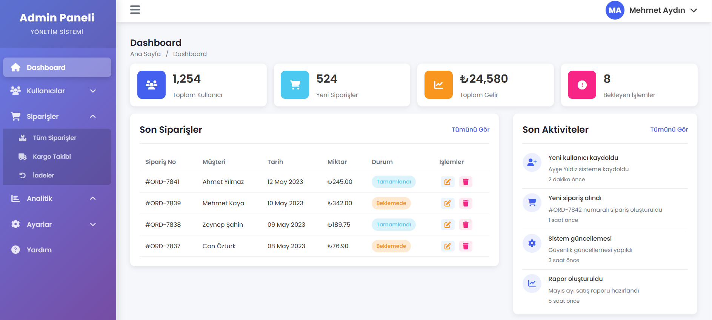
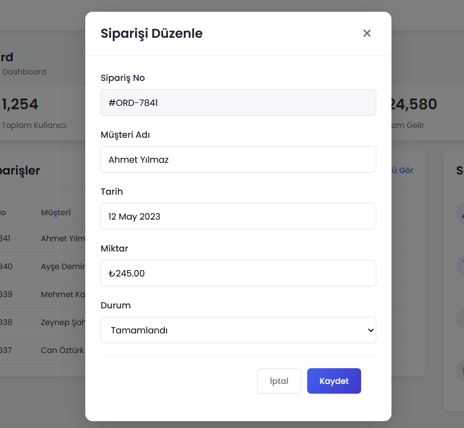

# Admin Template - Modern Dashboard

Responsive ve modern bir admin panel şablonu. Türkçe dil desteği, kolapsibil sidebar, modal dialog'lar ve düzenli bir tasarım ile geliştirilmiştir.

## 🎨 Özellikler

- ✨ **Modern Tasarım** - Gradient arka planları ve smooth animasyonlar
- 📱 **Responsive** - Tüm cihazlar için optimize edilmiş (mobil, tablet, desktop)
- 🎯 **Sidebar Toggle** - Sidebar'ı kolapsible hale getir/kapat
- 📂 **Alt Menüler** - Kategorilere göre organize edilmiş menüler
- 📊 **Dashboard Kartları** - İstatistik kartları ve veri görselleştirmesi
- 📋 **Veri Tablosu** - Sipariş yönetimi ile düzenle/sil işlemleri
- 🗂️ **Modal Dialog'lar** - Düzenleme formu ve silme onayı
- 🌐 **Türkçe Dil Desteği** - Tüm metinler Türkçe
- 💾 **LocalStorage** - Sidebar durumu kaydedilir

## 📸 Ekran Görüntüleri

### Ana Sayfa / Dashboard


### Düzenleme Dialog'u


Sipariş düzenleme formunun açıldığı modal dialog:
- Sipariş bilgilerini düzenle
- Form doğrulaması
- Kaydet/İptal seçenekleri

### Silme Onayı Dialog'u
Siparişi silmek için onay dialog'u:
- Uyarı simgesi
- Sipariş ID gösterilir
- Evet, Sil / İptal seçenekleri

*Ekran görüntüsü eklemek için: `screenshots/delete-confirmation.png` dosyasını ekleyin*

### Mobil Görünüm
Responsive tasarım mobil cihazlarda:
- Slider sidebar
- Optimize edilmiş layout
- Touch-friendly arayüz

*Ekran görüntüsü eklemek için: `screenshots/mobile-view.png` dosyasını ekleyin*

## 🚀 Başlangıç

### Gereksinimler
- Modern bir web tarayıcı (Chrome, Firefox, Safari, Edge)
- Hiçbir ek bağımlılık gerekmez - Vanilla JavaScript kullanır

### Dosya Yapısı
```
admintemplate1/
├── index.html          # Ana HTML dosyası
├── style.css           # CSS stil dosyası
├── script.js           # JavaScript dosyası
└── README.md          # Bu dosya
```

### Kullanım
1. `index.html` dosyasını bir web tarayıcıda açın
2. Sidebar'daki menülerle gezin
3. Tablo üzerindeki düzenleme ve silme butonlarını kullanın

## 🎮 Özellikler Detaylı

### Sidebar Navigasyon
- **Dashboard** - Ana sayfa
- **Kullanıcılar** - Kullanıcı yönetimi
  - Kullanıcı Listesi
  - Yeni Kullanıcı
  - Onay Bekleyenler
- **Siparişler** - Sipariş yönetimi
  - Tüm Siparişler
  - Kargo Takibi
  - İadeler
- **Analitik** - Analiz ve raporlar
  - Satış Raporu
  - Kategori Analizi
  - Müşteri İstatistikleri
- **Ayarlar** - Sistem ayarları
  - Sistem Ayarları
  - Güvenlik
  - E-posta Ayarları
  - Yedekleme
- **Yardım** - Yardım sayfası

### Sidebar Toggle
- Hamburger menü (☰) ile sidebar'ı kolapsible yapın
- Tercih localStorage'da kaydedilir
- Sayfa yenilendiğinde durum hatırlanır

### Tablo İşlemleri
- **Düzenle (Edit)** - Satırı düzenleme formunda aç
- **Sil (Delete)** - Silme onayı dialog'u aç
- Form verilerini güncelleyin
- Silme işlemini onaylayın veya iptal edin

## 🎨 Renk Şeması

```css
--primary: #4361ee      /* Mavi */
--secondary: #3f37c9    /* Koyu Mavi */
--success: #4cc9f0      /* Açık Mavi */
--danger: #f72585       /* Kırmızı */
--warning: #f8961e      /* Turuncu */
--dark: #1e1e2c         /* Çok Koyu */
--light: #f8f9fa        /* Açık */
```

## 🔧 Teknolojiler

- **HTML5** - Semantik markup
- **CSS3** - Modern stil ve animasyonlar
- **Vanilla JavaScript** - Hiçbir framework olmadan
- **Font Awesome** - İkonlar
- **Google Fonts** - Poppins font ailesi

## 📱 Responsive Tasarım

- **Desktop** (1200px+) - Tam genişlik sidebar
- **Tablet** (768px-1199px) - Dar sidebar (icon only)
- **Mobile** (< 768px) - Slider sidebar, optimize edilmiş layout

## 🤝 Katkılar

Bu proje açık kaynaklıdır. İyileştirmeler için pull request gönderebilirsiniz.

## 📄 Lisans

MIT Lisansı altında yayınlanmıştır.

## 👤 Yazar

Levent - [GitHub](https://github.com/levent1360)

---

**Not:** Ekran görüntüleri eklemek için `screenshots` klasörünü oluşturun ve görüntüleri buraya yerleştirin.